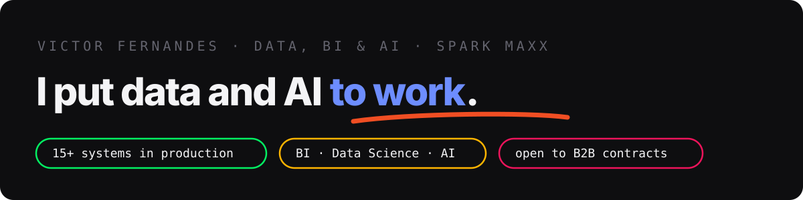

I lead **Data, BI & AI at Spark Maxx**, operating as the company's **CAIO (Chief AI Officer)**: the executive function that owns AI strategy, governance and implementation. And there's only one bar here: **systems in production**. 15+ so far: dashboards, autonomous agents, analysis and local AI, each one documented on my portfolio with the problem, the decision, the architecture and what the choice cost.

Open to **selected B2B remote contracts** (BR/US/Global).

---

## How I work

**Context before model.** A powerful model without context is wasted potential, so I treat context as infrastructure: every project carries living documentation that AI reads before acting. It's how 15+ simultaneous systems fit one person.

**Production is the bar.** Every case is written as problem → decision → architecture → **what the choice cost**. A write-up is only done when the trade-off is stated.

| 🏗️ Data Engineering (GCP & MDS) | 🧠 AI Architecture & Security | ⚡ Cloud Infra & Edge MLOps |
| :--- | :--- | :--- |
| $\color{#4285F4}{\textsf{\textbf{GCP Data Stack:}}}$ BigQuery, Cloud Storage, Pub/Sub, Dataflow. | $\color{#9370DB}{\textsf{\textbf{AI-in-the-loop:}}}$ LLM-as-a-judge verification to block hallucinations and prompt injections. | $\color{#32CD32}{\textsf{\textbf{Serverless and IaC:}}}$ Immutable infrastructure as code and CI/CD pipelines. |
| $\color{#FF6C37}{\textsf{\textbf{Batch and ELT:}}}$ dbt (Data Build Tool) for dimensional modeling and Medallion Architecture. | $\color{#8A2BE2}{\textsf{\textbf{Agentic Workflows:}}}$ Autonomous workflows leveraging Claude / OpenAI APIs. | $\color{#E74C3C}{\textsf{\textbf{Deep Tech:}}}$ Over-The-Air (OTA) computer vision updates with zero-downtime inference. |
| $\color{#00CED1}{\textsf{\textbf{DAG Orchestration:}}}$ Idempotent, high-throughput message brokering (Airflow/n8n paradigms). | $\color{#DA70D6}{\textsf{\textbf{AI Privacy:}}}$ Data masking and PII sanitization for LLM integrations. | $\color{#1ABC9C}{\textsf{\textbf{Robotics:}}}$ Local telemetry caching and async Cloud sync for ROS2 nodes. |

**Has your data problem outgrown the spreadsheet?** → [victordataengineerds@gmail.com](mailto:victordataengineerds@gmail.com)

