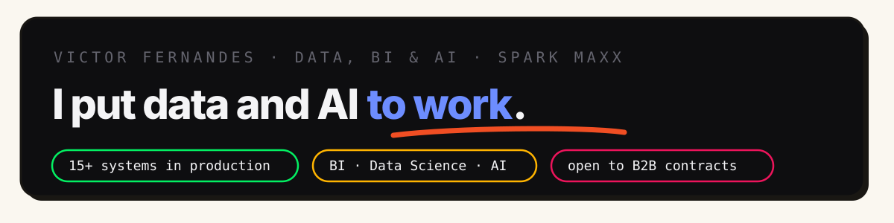

[**Portfolio →**](https://victorfernandes-blog.vercel.app) · [**English version →**](https://victorfernandes-blog.vercel.app/en) · [LinkedIn](https://www.linkedin.com/in/victor-alexandre-azevedo-fernandes-367120206/) · [victordataengineerds@gmail.com](mailto:victordataengineerds@gmail.com)

I lead **Data, BI & AI at Spark Maxx**, and there's only one bar here: **systems in production**. 15+ so far — dashboards, autonomous agents, analysis and local AI — each one documented on my portfolio with the problem, the decision, the architecture and what the choice cost.

Open to **selected B2B remote contracts** (BR/US/Global).

---

## How I work

**Context before model.** A powerful model without context is wasted potential — so I treat context as infrastructure: every project carries living documentation that AI reads before acting. It's how 15+ simultaneous systems fit one person.

**Production is the bar.** Every case is written as problem → decision → architecture → **what the choice cost**. A write-up is only done when the trade-off is stated.

| 🏗️ $\color{#4d82ff}{\textsf{\textbf{Data Engineering}}}$ | 🧠 $\color{#ED145B}{\textsf{\textbf{AI Engineering}}}$ | 📊 $\color{#03EF62}{\textsf{\textbf{Data Science}}}$ |
| :--- | :--- | :--- |
| $\color{#4d82ff}{\textsf{\textbf{GCP data stack:}}}$ BigQuery, Cloud Storage, Pub/Sub, Dataflow | $\color{#ED145B}{\textsf{\textbf{Agentic workflows:}}}$ Pydantic AI, CrewAI, LangGraph, Agents SDK | $\color{#03EF62}{\textsf{\textbf{Analysis:}}}$ Python, SQL, pandas, JupyterLab |
| $\color{#4d82ff}{\textsf{\textbf{ELT \& modeling:}}}$ dbt-style dimensional modeling, Medallion architecture | $\color{#ED145B}{\textsf{\textbf{RAG \& context:}}}$ retrieval pipelines, embeddings, living documentation as context | $\color{#03EF62}{\textsf{\textbf{Methods:}}}$ cohorts, survival curves, funnel analytics, forecasting |
| $\color{#4d82ff}{\textsf{\textbf{Databases:}}}$ PostgreSQL/Supabase, data quality tests, idempotent loads | $\color{#ED145B}{\textsf{\textbf{LLM ops:}}}$ Claude \& OpenAI APIs, local inference (Ollama/Mac Studio), serverless GPU (Modal) | $\color{#03EF62}{\textsf{\textbf{Delivery:}}}$ dashboards \& data products in Next.js, decision-grade write-ups |
| $\color{#4d82ff}{\textsf{\textbf{Orchestration:}}}$ DAG thinking (Airflow paradigms), n8n, cron + observability | $\color{#ED145B}{\textsf{\textbf{AI safety \& privacy:}}}$ guardrails, PII sanitization, LLM-as-a-judge verification | $\color{#03EF62}{\textsf{\textbf{Experimentation:}}}$ A/B testing foundations, Bayesian evaluation |

**Has your data problem outgrown the spreadsheet?** → [victordataengineerds@gmail.com](mailto:victordataengineerds@gmail.com)

